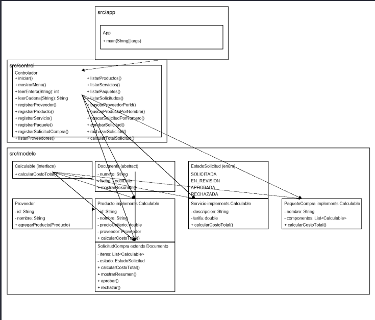

# Práctica -  Programación Orientada a Objetos en Java

## 📌 Información General

- **Título:**  Diseño y desarrollo de una aplicación orientada a objetos utilizando Java
- **Asignatura:** Programación Orientada a Objetos
- **Carrera:** Computación
- **Estudiante:** Michael Yumbla, Adriano Rodas 
- **Fecha:** 02/04/2025
- **Profesor:** Ing. Juan Pablo

---

## 🛠️ Descripción

Este proyecto consiste en el desarrollo de un sistema de gestión de compras como práctica de laboratorio, utilizando programación orientada a objetos en Java. Implementa principios como herencia, clases abstractas, interfaces funcionales, enumeraciones y polimorfismo dinámico.


Se permite elegir:
- Registrar el proovedor y el producto.
- Registrar solicitud de compra, servicio y paquete de compra.
- Elistar proveedores, productos, solicitudes de compra, paquetes y servicios.
- Buscar proveedor por ID, producto por nombre y solicitud por número.
- Aprobar solicitud y recharzar solicitud 
- EL calculo total de una solicitud

---

## 🚀 Ejecución

Para ejecutar el proyecto:

1. Compila el código:
    ```bash
    javac App.java
    ```
2. Ejecuta la aplicación:
    ```bash
    java App
    ```

---

## 🧑‍💻 Ejemplo de Entrada

```plaintext
===== GESTIÓN DE COMPRAS ERP =====
1.  Registrar proveedor
2.  Registrar producto
3.  Registrar servicio
4.  Registrar paquete de compra
5.  Registrar solicitud de compra
6.  Listar proveedores
7.  Listar productos
8.  Listar servicios
9.  Listar paquetes
10. Listar solicitudes de compra
11. Buscar proveedor por ID
12. Buscar producto por nombre
13. Buscar solicitud por número
14. Aprobar solicitud
15. Rechazar solicitud
16. Calcular total de una solicitud
17. Salir
Seleccione una opción:
===== GESTIÓN DE COMPRAS ERP =====
1.  Registrar proveedor
2.  Registrar producto
3.  Registrar servicio
4.  Registrar paquete de compra
5.  Registrar solicitud de compra
6.  Listar proveedores
7.  Listar productos
8.  Listar servicios
9.  Listar paquetes
10. Listar solicitudes de compra
11. Buscar proveedor por ID
12. Buscar producto por nombre
13. Buscar solicitud por número
14. Aprobar solicitud
15. Rechazar solicitud
16. Calcular total de una solicitud
17. Salir
Seleccione una opción: 1

-- Registrar nuevo proveedor --
ID numérico del proveedor: l
Error: el ID del proveedor debe contener solo números.

===== GESTIÓN DE COMPRAS ERP =====
1.  Registrar proveedor
2.  Registrar producto
3.  Registrar servicio
4.  Registrar paquete de compra
5.  Registrar solicitud de compra
6.  Listar proveedores
7.  Listar productos
8.  Listar servicios
9.  Listar paquetes
10. Listar solicitudes de compra
11. Buscar proveedor por ID
12. Buscar producto por nombre
13. Buscar solicitud por número
14. Aprobar solicitud
15. Rechazar solicitud
16. Calcular total de una solicitud
17. Salir
Seleccione una opción: 1

-- Registrar nuevo proveedor --
ID numérico del proveedor: 01
Nombre del proveedor: mike
Proveedor registrado con éxito.

===== GESTIÓN DE COMPRAS ERP =====
1.  Registrar proveedor
2.  Registrar producto
3.  Registrar servicio
4.  Registrar paquete de compra
5.  Registrar solicitud de compra
6.  Listar proveedores
7.  Listar productos
8.  Listar servicios
9.  Listar paquetes
10. Listar solicitudes de compra
11. Buscar proveedor por ID
12. Buscar producto por nombre
13. Buscar solicitud por número
14. Aprobar solicitud
15. Rechazar solicitud
16. Calcular total de una solicitud
17. Salir
Seleccione una opción: 11
Ingrese ID de proveedor a buscar: 01
Proveedor encontrado:
[Proveedor] id: 01, nombre: mike, #productos: 0

===== GESTIÓN DE COMPRAS ERP =====
1.  Registrar proveedor
2.  Registrar producto
3.  Registrar servicio
4.  Registrar paquete de compra
5.  Registrar solicitud de compra
6.  Listar proveedores
7.  Listar productos
8.  Listar servicios
9.  Listar paquetes
10. Listar solicitudes de compra
11. Buscar proveedor por ID
12. Buscar producto por nombre
13. Buscar solicitud por número
14. Aprobar solicitud
15. Rechazar solicitud
16. Calcular total de una solicitud
17. Salir
Seleccione una opción: 2

-- Registrar nuevo producto --
ID numérico del producto: l    
Error: el ID del producto debe contener solo números.

===== GESTIÓN DE COMPRAS ERP =====
1.  Registrar proveedor
2.  Registrar producto
3.  Registrar servicio
4.  Registrar paquete de compra
5.  Registrar solicitud de compra
6.  Listar proveedores
7.  Listar productos
8.  Listar servicios
9.  Listar paquetes
10. Listar solicitudes de compra
11. Buscar proveedor por ID
12. Buscar producto por nombre
13. Buscar solicitud por número
14. Aprobar solicitud
15. Rechazar solicitud
16. Calcular total de una solicitud
17. Salir
Seleccione una opción: 2

-- Registrar nuevo producto --
ID numérico del producto: 02
Nombre del producto: mouse
Precio unitario: 15.00
Seleccione el proveedor por número:
  1. mike (01)
Número de proveedor: 1
Producto registrado con éxito.

===== GESTIÓN DE COMPRAS ERP =====
1.  Registrar proveedor
2.  Registrar producto
3.  Registrar servicio
4.  Registrar paquete de compra
5.  Registrar solicitud de compra
6.  Listar proveedores
7.  Listar productos
8.  Listar servicios
9.  Listar paquetes
10. Listar solicitudes de compra
11. Buscar proveedor por ID
12. Buscar producto por nombre
13. Buscar solicitud por número
14. Aprobar solicitud
15. Rechazar solicitud
16. Calcular total de una solicitud
17. Salir
Seleccione una opción: 3

-- Registrar nuevo servicio --
Descripción del servicio: tecnico
Tarifa: 40
Servicio registrado con éxito: [Servicio] tecnico -Tarifa: $40.00

===== GESTIÓN DE COMPRAS ERP =====
1.  Registrar proveedor
2.  Registrar producto
3.  Registrar servicio
4.  Registrar paquete de compra
5.  Registrar solicitud de compra
6.  Listar proveedores
7.  Listar productos
8.  Listar servicios
9.  Listar paquetes
10. Listar solicitudes de compra
11. Buscar proveedor por ID
12. Buscar producto por nombre
13. Buscar solicitud por número
14. Aprobar solicitud
15. Rechazar solicitud
16. Calcular total de una solicitud
17. Salir
Seleccione una opción: 4

-- Registrar nuevo paquete de compra --
Nombre del paquete: amazon
¿Qué desea agregar al paquete?
1. Producto
2. Servicio
Opción: 1
Productos disponibles:
  1. 02 | mouse | $15.00
Número de producto a agregar: 1
Producto agregado al paquete.
¿Desea agregar otro componente? (s/n): s
¿Qué desea agregar al paquete?
1. Producto
2. Servicio
Opción: 2
Servicios disponibles:
  1. [Servicio] tecnico -Tarifa: $40.00
Número de servicio a agregar: 1
Servicio agregado al paquete.
¿Desea agregar otro componente? (s/n): n
Paquete registrado con éxito: [PaqueteCompra] amazon -$55.00

===== GESTIÓN DE COMPRAS ERP =====
1.  Registrar proveedor
2.  Registrar producto
3.  Registrar servicio
4.  Registrar paquete de compra
5.  Registrar solicitud de compra
6.  Listar proveedores
7.  Listar productos
8.  Listar servicios
9.  Listar paquetes
10. Listar solicitudes de compra
11. Buscar proveedor por ID
12. Buscar producto por nombre
13. Buscar solicitud por número
14. Aprobar solicitud
15. Rechazar solicitud
16. Calcular total de una solicitud
17. Salir
Seleccione una opción: 5

-- Registrar nueva solicitud de compra --
Número de la solicitud: aprobacion 
Error: el número de la solicitud debe contener solo números.

===== GESTIÓN DE COMPRAS ERP =====
1.  Registrar proveedor
2.  Registrar producto
3.  Registrar servicio
4.  Registrar paquete de compra
5.  Registrar solicitud de compra
6.  Listar proveedores
7.  Listar productos
8.  Listar servicios
9.  Listar paquetes
10. Listar solicitudes de compra
11. Buscar proveedor por ID
12. Buscar producto por nombre
13. Buscar solicitud por número
14. Aprobar solicitud
15. Rechazar solicitud
16. Calcular total de una solicitud
17. Salir
Seleccione una opción: 5

-- Registrar nueva solicitud de compra --
Número de la solicitud: 1
¿Qué desea agregar a la solicitud?
1. Producto
2. Servicio
3. Paquete
Opción: 1
Productos disponibles:
  1. 02 | mouse | $15.00
Número de producto a agregar: 1
Producto agregado a la solicitud.
¿Desea agregar otro ítem? (s/n): s
¿Qué desea agregar a la solicitud?
1. Producto
2. Servicio
3. Paquete
Opción: 3
Paquetes disponibles:
  1. [PaqueteCompra] amazon -$55.00
Número de paquete a agregar: 1
Paquete agregado a la solicitud.
¿Desea agregar otro ítem? (s/n): s
¿Qué desea agregar a la solicitud?
1. Producto
2. Servicio
3. Paquete
Opción: 2
Servicios disponibles:
  1. [Servicio] tecnico  -Tarifa: $40.00
Número de servicio a agregar: 1
Servicio agregado a la solicitud.
¿Desea agregar otro ítem? (s/n): n
Solicitud de compra registrada con éxito.

===== GESTIÓN DE COMPRAS ERP =====
1.  Registrar proveedor
2.  Registrar producto
3.  Registrar servicio
4.  Registrar paquete de compra
5.  Registrar solicitud de compra
6.  Listar proveedores
7.  Listar productos
8.  Listar servicios
9.  Listar paquetes
10. Listar solicitudes de compra
11. Buscar proveedor por ID
12. Buscar producto por nombre
13. Buscar solicitud por número
14. Aprobar solicitud
15. Rechazar solicitud
16. Calcular total de una solicitud
17. Salir
Seleccione una opción: 6

-- Lista de proveedores --
- [Proveedor] id: 01, nombre: mike, #productos: 1

===== GESTIÓN DE COMPRAS ERP =====
1.  Registrar proveedor
2.  Registrar producto
3.  Registrar servicio
4.  Registrar paquete de compra
5.  Registrar solicitud de compra
6.  Listar proveedores
7.  Listar productos
8.  Listar servicios
9.  Listar paquetes
10. Listar solicitudes de compra
11. Buscar proveedor por ID
12. Buscar producto por nombre
13. Buscar solicitud por número
14. Aprobar solicitud
15. Rechazar solicitud
16. Calcular total de una solicitud
17. Salir
Seleccione una opción: 7

-- Lista de productos --
- [Producto] id: 02, nombre: mouse, precioUnitario: 15.00, proveedor: mike

===== GESTIÓN DE COMPRAS ERP =====
1.  Registrar proveedor
2.  Registrar producto
3.  Registrar servicio
4.  Registrar paquete de compra
5.  Registrar solicitud de compra
6.  Listar proveedores
7.  Listar productos
8.  Listar servicios
9.  Listar paquetes
10. Listar solicitudes de compra
11. Buscar proveedor por ID
12. Buscar producto por nombre
13. Buscar solicitud por número
14. Aprobar solicitud
15. Rechazar solicitud
16. Calcular total de una solicitud
17. Salir
Seleccione una opción: 8

-- Lista de servicios --
- [Servicio] tecnico -Tarifa: $40.00

===== GESTIÓN DE COMPRAS ERP =====
1.  Registrar proveedor
2.  Registrar producto
3.  Registrar servicio
4.  Registrar paquete de compra
5.  Registrar solicitud de compra
6.  Listar proveedores
7.  Listar productos
8.  Listar servicios
9.  Listar paquetes
10. Listar solicitudes de compra
11. Buscar proveedor por ID
12. Buscar producto por nombre
13. Buscar solicitud por número
14. Aprobar solicitud
15. Rechazar solicitud
16. Calcular total de una solicitud
17. Salir
Seleccione una opción: 9

-- Lista de paquetes de compra --
- [PaqueteCompra] amazon -$55.00

===== GESTIÓN DE COMPRAS ERP =====
1.  Registrar proveedor
2.  Registrar producto
3.  Registrar servicio
4.  Registrar paquete de compra
5.  Registrar solicitud de compra
6.  Listar proveedores
7.  Listar productos
8.  Listar servicios
9.  Listar paquetes
10. Listar solicitudes de compra
11. Buscar proveedor por ID
12. Buscar producto por nombre
13. Buscar solicitud por número
14. Aprobar solicitud
15. Rechazar solicitud
16. Calcular total de una solicitud
17. Salir
Seleccione una opción: 10

-- Lista de solicitudes de compra --
SolicitudCompra [1] - Fecha: 2025-06-01 - Total: $110.00 - Estado: SOLICITADA
Items:
  - [Producto] id: 02, nombre: mouse, precioUnitario: 15.00, proveedor: mike
  - [PaqueteCompra] amazon - $55.00
  - [Servicio] tecnico - Tarifa: $40.00
------------------------------

===== GESTIÓN DE COMPRAS ERP =====
1.  Registrar proveedor
2.  Registrar producto
3.  Registrar servicio
4.  Registrar paquete de compra
5.  Registrar solicitud de compra
6.  Listar proveedores
7.  Listar productos
8.  Listar servicios
9.  Listar paquetes
10. Listar solicitudes de compra
11. Buscar proveedor por ID
12. Buscar producto por nombre
13. Buscar solicitud por número
14. Aprobar solicitud
15. Rechazar solicitud
16. Calcular total de una solicitud
17. Salir
Seleccione una opción: 11
Ingrese ID de proveedor a buscar: 01
Proveedor encontrado:
[Proveedor] id: 01, nombre: mike, #productos: 1

===== GESTIÓN DE COMPRAS ERP =====
1.  Registrar proveedor
2.  Registrar producto
3.  Registrar servicio
4.  Registrar paquete de compra
5.  Registrar solicitud de compra
6.  Listar proveedores
7.  Listar productos
8.  Listar servicios
9.  Listar paquetes
10. Listar solicitudes de compra
11. Buscar proveedor por ID
12. Buscar producto por nombre
13. Buscar solicitud por número
14. Aprobar solicitud
15. Rechazar solicitud
16. Calcular total de una solicitud
17. Salir
Seleccione una opción: 12
Ingrese nombre (completo o parcial) del producto: mouse
Productos encontrados:
- [Producto] id: 02, nombre: mouse, precioUnitario: 15.00, proveedor: mike

===== GESTIÓN DE COMPRAS ERP =====
1.  Registrar proveedor
2.  Registrar producto
3.  Registrar servicio
4.  Registrar paquete de compra
5.  Registrar solicitud de compra
6.  Listar proveedores
7.  Listar productos
8.  Listar servicios
9.  Listar paquetes
10. Listar solicitudes de compra
11. Buscar proveedor por ID
12. Buscar producto por nombre
13. Buscar solicitud por número
14. Aprobar solicitud
15. Rechazar solicitud
16. Calcular total de una solicitud
17. Salir
Seleccione una opción: 13
Ingrese número de solicitud a buscar: 1
Solicitud encontrada:
SolicitudCompra [1] - Fecha: 2025-06-01 - Total: $110.00 - Estado: SOLICITADA
Items:
  - [Producto] id: 02, nombre: mouse, precioUnitario: 15.00, proveedor: mike
  - [PaqueteCompra] amazon - $55.00
  - [Servicio] tecnico - Tarifa: $40.00

===== GESTIÓN DE COMPRAS ERP =====
1.  Registrar proveedor
2.  Registrar producto
3.  Registrar servicio
4.  Registrar paquete de compra
5.  Registrar solicitud de compra
6.  Listar proveedores
7.  Listar productos
8.  Listar servicios
9.  Listar paquetes
10. Listar solicitudes de compra
11. Buscar proveedor por ID
12. Buscar producto por nombre
13. Buscar solicitud por número
14. Aprobar solicitud
15. Rechazar solicitud
16. Calcular total de una solicitud
17. Salir
Seleccione una opción: 14
Número de solicitud a aprobar: 1
Solicitud "1" ahora está en estado: APROBADA

===== GESTIÓN DE COMPRAS ERP =====
1.  Registrar proveedor
2.  Registrar producto
3.  Registrar servicio
4.  Registrar paquete de compra
5.  Registrar solicitud de compra
6.  Listar proveedores
7.  Listar productos
8.  Listar servicios
9.  Listar paquetes
10. Listar solicitudes de compra
11. Buscar proveedor por ID
12. Buscar producto por nombre
13. Buscar solicitud por número
14. Aprobar solicitud
15. Rechazar solicitud
16. Calcular total de una solicitud
17. Salir
Seleccione una opción: 10

-- Lista de solicitudes de compra --
SolicitudCompra [1] - Fecha: 2025-06-01 - Total: $110.00 - Estado: APROBADA
Items:
  - [Producto] id: 02, nombre: mouse, precioUnitario: 15.00, proveedor: mike
  - [PaqueteCompra] amazon - $55.00
  - [Servicio] tecnico - Tarifa: $40.00
------------------------------

===== GESTIÓN DE COMPRAS ERP =====
1.  Registrar proveedor
2.  Registrar producto
3.  Registrar servicio
4.  Registrar paquete de compra
5.  Registrar solicitud de compra
6.  Listar proveedores
7.  Listar productos
8.  Listar servicios
9.  Listar paquetes
10. Listar solicitudes de compra
11. Buscar proveedor por ID
12. Buscar producto por nombre
13. Buscar solicitud por número
14. Aprobar solicitud
15. Rechazar solicitud
16. Calcular total de una solicitud
17. Salir
Seleccione una opción: 15
Número de solicitud a rechazar: 1
Solicitud "1" ahora está en estado: RECHAZADA

===== GESTIÓN DE COMPRAS ERP =====
1.  Registrar proveedor
2.  Registrar producto
3.  Registrar servicio
4.  Registrar paquete de compra
5.  Registrar solicitud de compra
6.  Listar proveedores
7.  Listar productos
8.  Listar servicios
9.  Listar paquetes
10. Listar solicitudes de compra
11. Buscar proveedor por ID
12. Buscar producto por nombre
13. Buscar solicitud por número
14. Aprobar solicitud
15. Rechazar solicitud
16. Calcular total de una solicitud
17. Salir
Seleccione una opción: 16
Número de solicitud para calcular total: 1
Total de la solicitud "1": $110.00

===== GESTIÓN DE COMPRAS ERP =====
1.  Registrar proveedor
2.  Registrar producto
3.  Registrar servicio
4.  Registrar paquete de compra
5.  Registrar solicitud de compra
6.  Listar proveedores
7.  Listar productos
8.  Listar servicios
9.  Listar paquetes
10. Listar solicitudes de compra
11. Buscar proveedor por ID
12. Buscar producto por nombre
13. Buscar solicitud por número
14. Aprobar solicitud
15. Rechazar solicitud
16. Calcular total de una solicitud
17. Salir
Seleccione una opción: 17
Saliendo del sistema?

```

---

## 📈🖼️Diagrama UML



